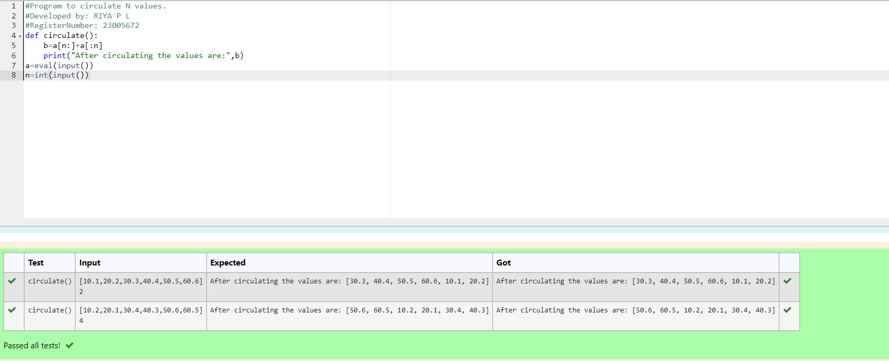

# Circulate-the-values-of-N-variables
## Aim:
To write a python program to circulate the n variables using function concept
## Equipment’s required:
PC
Anaconda - Python 3.7
## Algorithm: 
### Step 1: 
Get the list input from the user
### Step 2: 
Get the value from the user for the number of rotation
### Step 3: 
Define the function for the coressponnding program
### Step 4: 
Using the slicing concept rotate the list

### Step 5: 
Call the function
### Step 6:
End the program 
## Program:
```PYTHON
#Program to circulate N values.
#Developed by: RIYA P L
#RegisterNumber: 23005672
def circulate():
    b=a[n:]+a[:n]
    print("After circulating the values are:",b)
a=eval(input())
n=int(input())
```

## Output:


## Result:
